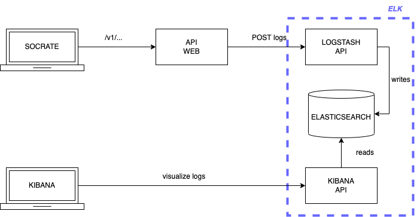
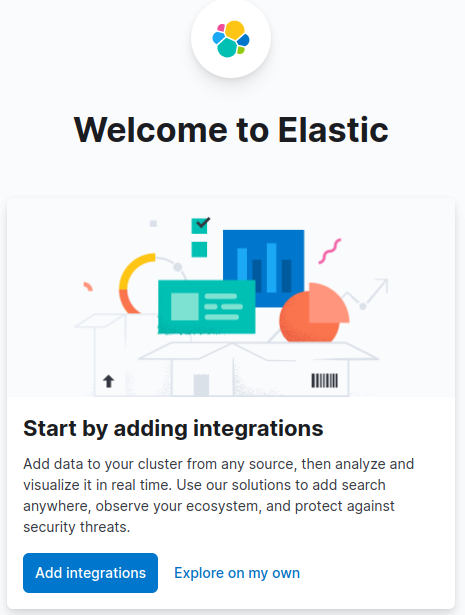
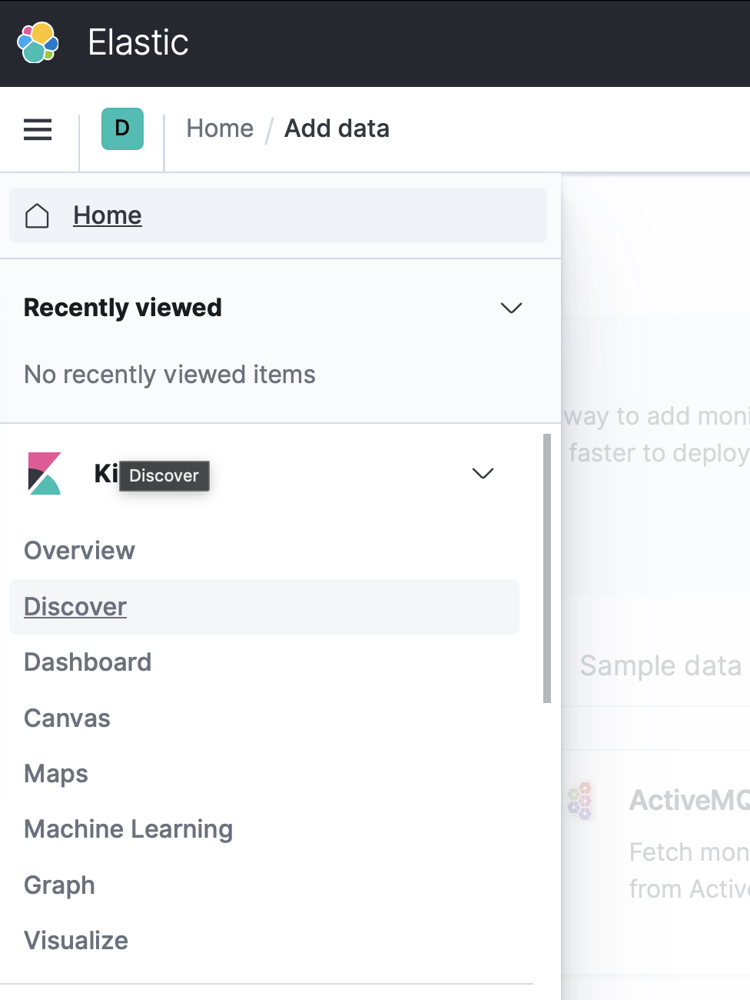
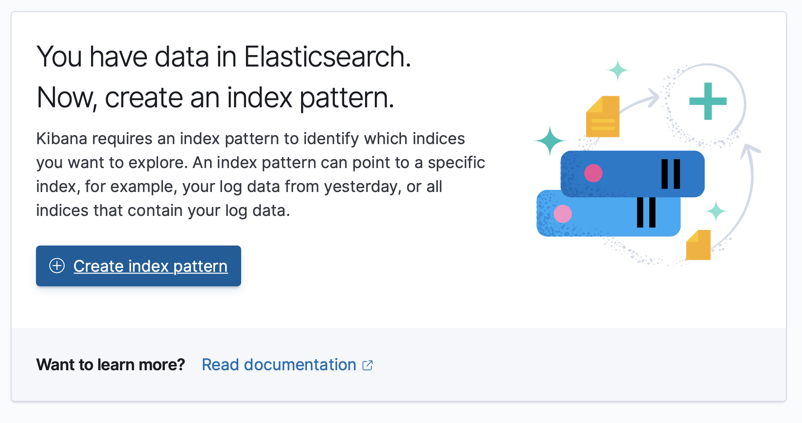
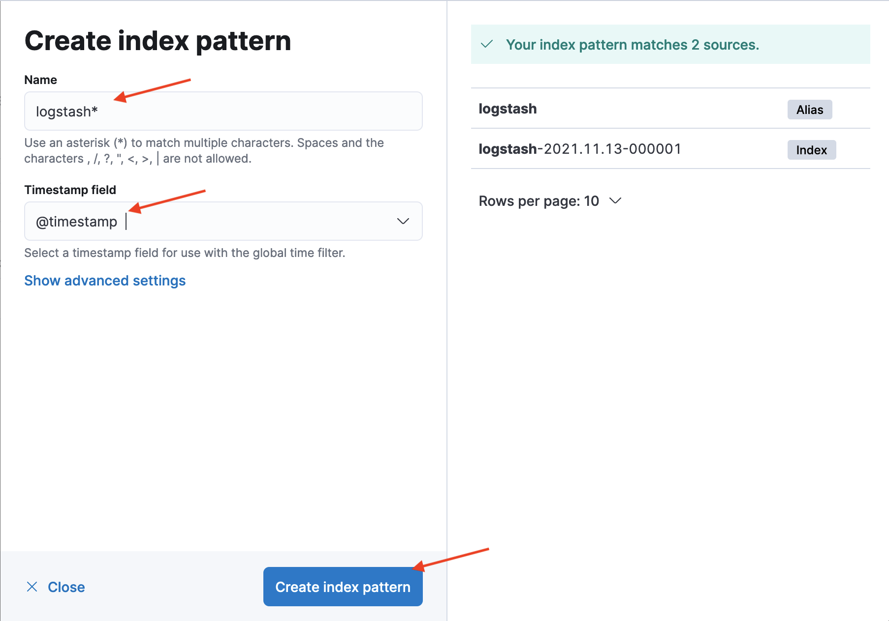
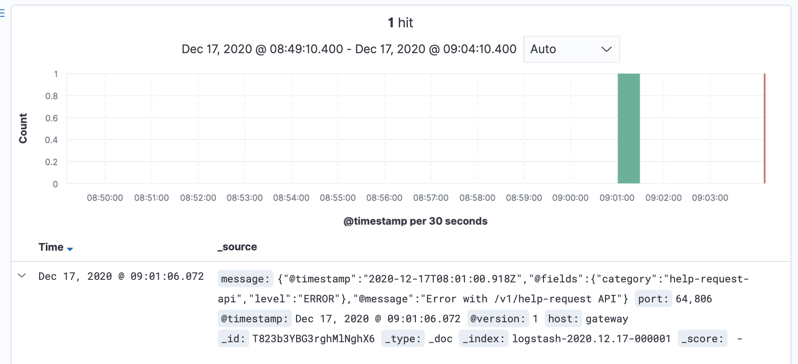

# Monitoring Workshop

This workshop is for student of EPITA SIGL 2023.

In this workshop you will:
- Add some logging (not login!) to the web API of Socrate
- Push those logs to an ELK (Elastic, Logstash, Kibana) stack

Here are differents the different tools in actions:



You will deploy all those tools on your localhost, and try out to visualize logs on Kibana
base on the usage of Socrate on your localhost.

Then, you will configure SOCRATE backend to log some info to a logstash on production.

## Step 1: Setup a local ELK stack

In this step, you start an ELK stack:
- a container for ElasticSearch database to hold your logs
- a container for Logstash to ingest logs from your API
- a container to expose Kibana on your localhost

We found a nice all-in-one github repository that launches the latest ELK stack using a single docker-compose file.

To run ELK on your local machine:

1. Clone [socra-sigl-2023/elk](https://github.com/socra-sigl-2023/elk) (generated from [deviantony/docker-elk](https://github.com/deviantony/docker-elk) on your computer (doesn't matter where).
1. run the docker compose file in daemon mode: 
```sh
# from elk/
docker compose up -d
```
> This may take a while to get all docker images (some hundreds of megabytes).

Once your container are running, give Kibana a minute to start, and check if you can reach kibana from your browser on http://localhost:5601

Credentials are:
- user: `elastic`
- password: `changeme`

Please don't perform any action yet, as we didn't send any logs.

Once we send the first logs, kibana setup will be easier.

## Step 2: Configure logs for Socrate web API

Let's add a new logger module, connected to your local logstash.

### Install new dependencies

You need to install the following node modules in your web API:
1. `log4js` to have logging tagged with specific names. And different level of loggings (`trace`, `debug`, `info`, `warn` and `error`).
    > About differents log's **level**:
    > - `trace`: when you need to use it to track a request path, this is for very specific debug sessions
    > - `debug`: when you want to debug some values in some functions
    > - `info`: when you want to logs some information to help you understand usage of your app
    > - `warning`: when something is wrong, but not critical for the user
    > - `error`: when an error is thrown, and it's a bug.
    >
    > When you set your logging level to `trace` in your `log4js` config options, it means that **ALL** log levels from trace to error will be send to both `console` and `logstash` > appenders.
    > 
    > If you set your log level to `error` in the `categories.default.level` config, only logs with `error` level will be sent.
1. `log4js-logstash` an adapter for `log4js` to send logs to a logstash service

To do so, from Socrate's `backend/` folder, install modules:
```sh
# from backend/
nvm use v16
npm i --save log4js log4js-logstash
```

### Log some information

Let's configure a new logger for your web api.

**Objective**: Log when a user requests discounts.

First, you need to configure your logger to connect to your logstash.

From your group's repository:
- Add `logstash` host and port info to your `backend/.env` file (under your database env variables):
```toml
LOGSTASH_HOST=localhost
LOGSTASH_PORT=5000
```
- Adapt your `backend/src/server.js` to add the logger configuration to your web API:
```js
// ...
const log4js = require('log4js');

// ...

const loggerConfig = {
  appenders: {
    stdout: {
      type: "console",
      layout: {
        type: "coloured",
      },
    },
    logstash: {
      type: "log4js-logstash",
      host: process.env.LOGSTASH_HOST,
      port: process.env.LOGSTASH_PORT,
    },
  },
  categories: {
    default: {
      appenders: ['stdout', 'logstash'],
      level: 'trace' // we sent all logs from trace to error
    }
  },
};

log4js.configure(loggerConfig);
```

This configure a new logger that will **output** logs on:
- your console, thanks to the console appender
- your logstrash instance running on your localhost, thanks to `log4js-logstash` appender

You have set in `categories` default behaviour to send all log's **level** to both appenders.


- Adapt `backend/src/server.js` with:
```js
//...
const discountLogger = log4js.getLogger('discounts');
app.get("/v1/discounts", async (req, res) => {
  try {
    const discounts = await RDB.getAvailableDiscounts(0, 4);
    discountLogger.info("discounts requested");
    res.send(discounts);
  } catch (e) {
    res.send({ error: e.message });
  }
});
//...
```
- `log4js.getLogger` instanciates a new logger for discounts
- `discountLogger.info` will log `discounts requested` with the **loglevel info** when a request to `/v1/discounts` is successfull
- `discountLogger.error` will log the error when a request to `/v1/discounts` is failing

Run your frontend and your api on your local machine.

- Run frontend in one shell:
```sh 
# from frontend/
nvm use v16
npm start
```
- Run api in another shell:
```sh
# from backend/
nvm use v16
node src/server.js
```
- Start your `docker-compose.yaml` from the database workshop, to have your Postgres instance running.

Now, navigate to your app and load some discounts.

If you see some `INFO` or `ERROR` logs on your stdout of `backend/` shell, you can proceed to the next step.

> Note: feel free to make your API failed en purpose to see if your error is logged correctly.
>  e.g. you can use `throw new Error("BOOM");` in the `try` statement

### Step 4: Configure Kibana to read from elasticSearch

Go to kibana dashboard on http://localhost:5601

Login with credentials:
- user: `elasctic`
- password: `changeme`

You should see a welcome screen like:


- Click on `Add data`
- On the sidebar menu icon, select the discover section:


> Note: You should see that kibana noticed you have some logs in your elasticsearch, but you don't have any indexes yet to search on those logs.
> Let's create them!

- Select `Create index` button:

- Enter `logstash*` as index pattern name
- Select `@timestamp` in the dropdown menu
- Click `Create index pattern`:

- Go back to the sidebar menu > discover view.

You should see your logs from previous step:


By default, it shows logs from latest 15 minutes, you can increase the time range to find back your logs if it was more that 15 minutes ago.

Congratulation!! You've just setup a whole ELK stack and connect logs from your API.

Now, you can produce more logs of different level, and try to query them in the discover section, create dashboard with custom visualizations and more.

### Step 5 - Challenge: add logger for categories

**Objective**: Create a logger for product categories:
- log info of which category has been queried with the format `category <categoryId> selected` (categoryId being the category selected by the user) 
- log error if something wrong happened with the format `an error occurred: <error message>` (error message being the reason of the error)

### Step 6 - Challenge: Adapt your CICD

When your app is on production, it should send logs both on **stdout** and to the **logstash on production**.

**Objective**: Adapt your backend's CICD to:
- set LOGSTASH_HOST to `pro.logstash.socra-sigl.fr`
- set LOGSTASH_PORT to `5000`

> Hint: You don't have to change much! It's exactly the same principle than for database workshop.

You should be able to see your logs on https://kibana.pro.socra-sigl.fr
